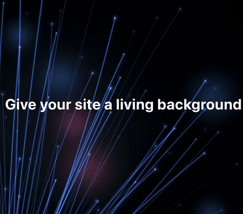

### Hi, I'm Ruslan 👋 Fullstack engineer (frontend-heavy), 20+ years shipping software

Started with Delphi in the '90s, now writing TypeScript, and I still find bugs in my own code from 2005.

🟢 **Open to Staff / Lead Frontend roles & contracts** (remote, EU) · Need a product built? → [Vialan](https://vialan.com.ua/)

- 🔭 I'm currently working on [CarCRM](https://carcrm.app), a multi-tenant SaaS for car dealers, built under [Vialan](https://vialan.com.ua/)
- 🌱 I'm currently learning shaders (GLSL), one broken triangle at a time
- 👯 I'm looking to collaborate on React / Next.js / Vue.js
- 💬 Ask me about multi-tenant SaaS, Three.js, TypeScript
- 📫 How to reach me: [rusic@fastmail.com](mailto:rusic@fastmail.com) · [LinkedIn](https://www.linkedin.com/in/rusicsemenov/) · [Vialan contacts](https://vialan.com.ua/en/contacts)
- 😄 Pronouns: It ))
- ⚡ Fun fact: Read Pronouns again )))

#### 🛠 Stack

Plus tRPC · GLSL · Playwright · Vitest

#### 🚀 Featured

- **[CarCRM](https://carcrm.app)**: Multi-tenant SaaS with an isolated PostgreSQL database per dealer. Next.js 16, tRPC, Prisma, Auth.js. Built in 4 weeks.
- **[Shader playground](https://shader.vialan.com.ua)**: WebGL / GLSL experiments ([source](https://github.com/rusicsemenov/shaders))

📄 Full resume → [vialan.com.ua/resume](https://vialan.com.ua/resume)
